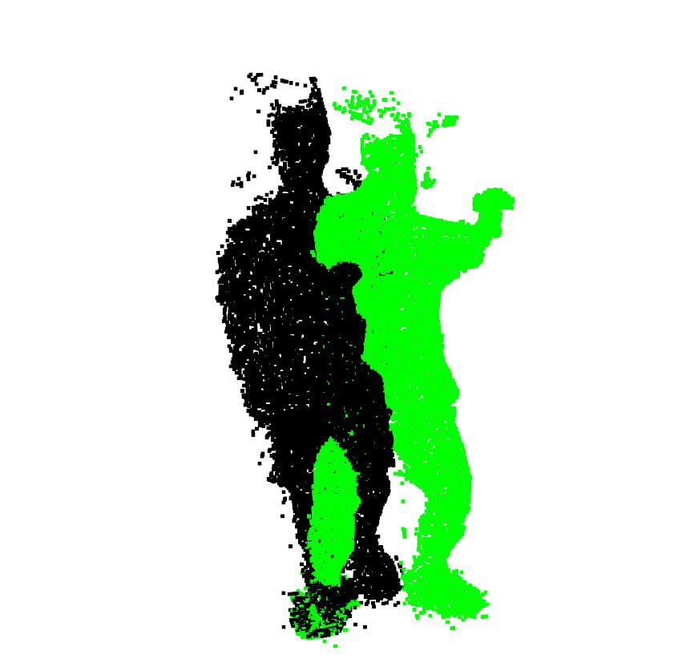

# NICP
[](https://www.murphysec.com/console/report/1716724397737033728/1716724400459137024) 

由于最近在做人体表面重建的项目，因此需要使用到ICP和NICP。

所以使用pytorch进行NICP([Optimal Step Nonrigid ICP Algorithms for Surface Registration](https://ieeexplore.ieee.org/stamp/stamp.jsp?tp=&arnumber=4270190))的复现


主要用到的包如下：

```shell
python=3.8
pytorch=1.8.0+cu111
scikit-learn==1.1.1
open3d==0.11.1
```


点云数据见data目录，pkl文件有三个key,分别是points,color,tex。

points对应着点云 N x 3维

color 点云对应颜色 N x 3维

tex 纹理信息 N x 3 维

NICP只用到了points信息，所以其他可以占时不考虑

## 配准

```
python nicp.py
```

可以修改 nicp文件里面的nicp方法，最后部分直接进行结果展示。我是在Ubuntu服务器上运行所以需要暂存点云文件。至于Ubuntu可以直接显示open3d的同样可以修改这部分通过服务器观察结果。

## 可视化结果

```
python load_data.py
```

### 配准前



### 配准后


